# **n\-t 좌표계**

**1. 2차원 평면 운동 방정식(x,y 좌표계)**


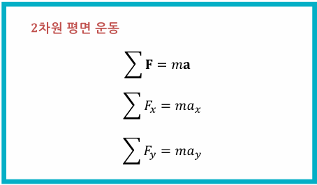


**뉴턴의 제2법칙을 활용한 기본 방정식**

-  $\displaystyle \sum \vec{F} =m\vec{a}$ 
-  여기서 $\vec{F}$ 는 총합 힘, $m$ 은 질량, $\vec{a}$ 는 가속도를 나타냅니다. 

**각 방향 성분별로 나타낸 식**

-  $\sum F_x =ma_x$ �: x축 방향의 힘과 가속도 관계 
-  $\sum F_y =ma_y$ : y축 방향의 힘과 가속도 관계 

**2. 접선과 법선 성분을 활용한 운동 방정식(n\-t 좌표계)**


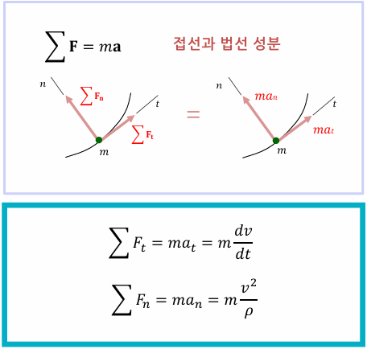

-  물체의 움직임이 곡선 궤적을 따르는 경우, 힘을 접선 성분과 법선 성분으로 나눌 수 있습니다. 

**접선 방향 성분 (t 방향)**

-  $\sum F_t =ma_t =m\frac{dv}{dt}$ � 
-  접선 방향 성분은 속도의 변화율에 의해 결정되며, 이는 물체의 가속도와 동일합니다. 

**법선 방향 성분 (n 방향)**

-  $\sum F_n =ma_n =m\frac{v^2 }{\rho }$ � 
-  여기서 $v$ 는 물체의 속도, $\rho$ 는 곡률 반경입니다. 
-  이 식은 원운동에서 구심력과 유사하며, 물체의 곡선 궤적에서 중심 방향으로 작용하는 힘을 나타냅니다. 

#  **문제** 

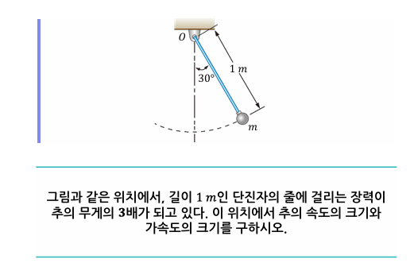


**주어진 정보**

-  추의 길이: $L=1\,m$ 
-  각도: $\theta =30°$ 
-  장력 $T=3mg$ 
-  중력 가속도 $g=9.81\,m/s^2$ 

**풀이 과정**


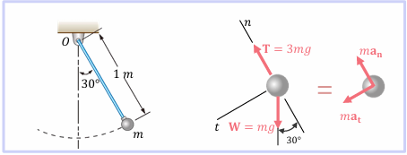


**1. 접선 방향 가속도 (** $a_t$ **�****)**

-  뉴턴의 제2법칙에 따라, 접선 방향 가속도는 다음과 같이 구할 수 있습니다. 

 $\sum F_t =ma_t$ �

-  중력의 접선 방향 성분은 $mg\sin (30° )$ 입니다. 
-  따라서, 

 $$ mg\sin (30° )=ma_t $$ 

 $$ a_t =g\sin (30° ) $$ 

 $$ a_t =9.81\times 0.5=4.9\,m/s^2 $$ 

**2. 법선 방향 가속도 (** $a_n$ **�****)**

-  장력과 중력의 합력은 구심 가속도를 유발합니다. 
-  $T-mg\cos (30° )=ma_n$ � 

 $3mg-mg\cos (30° )=ma_n$ �

-  $\cos (30° )=\frac{\sqrt{3}}{2}\approx 0.866$ 을 대입하면, 

 $$ 3g-g\times 0.866=a_n $$ 

 $$ a_n =(3-0.866)g\approx 2.134g $$ 

 $$ a_n \approx 2.134\times 9.81=20.93\,m/s^2 $$ 

-  추의 접선 방향 가속도는 $a_t =4.9\,m/s^2$ 입니다. 
-  법선 방향 가속도는 $a_n =20.93\,m/s^2$ 입니다. 

**3. 가속도 크기 계산**


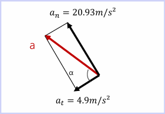

-  접선 방향 가속도 $a_t =4.9\,m/s^2$ 
-  법선 방향 가속도 $a_n =20.93\,m/s^2$ 

가속도의 크기 $a$ 는 피타고라스 정리를 이용하여 계산됩니다.

 $$ a=\sqrt{a_t^2 +a_n^2 } $$ 

 $$ a=\sqrt{(4.9)^2 +(20.93)^2 } $$ 

 $$ a\approx 21.50\,m/s^2 $$ 

 **4. 가속도의 방향** $\alpha$ 

-  접선 및 법선 가속도 간의 각도 $\alpha$ 를 구합니다. 

 $$ \tan \alpha =\frac{a_n }{a_t }=\frac{20.93}{4.9} $$ 

 $$ \alpha \approx 76.8° $$ 

 **5. 속도** $v$ **계산** 

-  법선 방향 가속도 $a_n =\frac{v^2 }{\rho }$ 에서 속도를 구합니다. 여기서 $\rho$ 는 곡률 반경으로 주어진 길이 $L=1\,m$ 입니다. 

 $$ v^2 =\rho a_n $$ 

 $$ v^2 =1\cdot 20.93 $$ 

 $$ v\approx 4.57\,m/s $$ 

**결론**

-  추의 가속도 크기는 $21.50\,m/s^2$ 
-  추의 속도는 $4.57\,m/s$ 입니다. 
-  가속도와 접선 방향 사이의 각도는 $76.8°$ 입니다. 
### **(추가계산시도)접선 방향에서 속도 계산**

**접근 방법**


접선 방향 가속도 $a_t$ 를 사용하면 다음 식을 사용하여 속도를 구할 수 있습니다:


 $a_t =\frac{dv}{dt}$ �


이 경우 가속도는 일정한 값이 아니기 때문에 속도는 위치 변화에 따라 계산해야 합니다.


 **1.** $a_t$ **�****를 호의 길이에 대한 식으로 표현**

-  호의 길이 $s=L\theta$ 이고, 여기서 $L=1\,m,\theta =30° =\frac{\pi }{6}\,rad$ 
-  호의 길이는 $s=L\cdot \theta =1\cdot \frac{\pi }{6}\approx 0.5236\,m$ 입니다. 

**2. 접선 방향 가속도에서 속도 계산**

-  에너지 보존의 법칙을 이용하면 

 $$ v^2 =2a_t s $$ 

여기서 $s$ 는 이동 거리입니다.

-  따라서, 

 $$ v^2 =2\cdot 4.9\cdot 0.5236 $$ 

 $$ v^2 \approx 5.126\,m^2 /s^2 $$ 

 $$ v\approx \sqrt{5.126}\approx 2.26\,m/s $$ 

**비교 결과**

-  법선 방향 가속도를 사용해 계산한 결과: $v\approx 4.57\,m/s$ 
-  접선 방향 가속도를 사용해 계산한 결과: $v\approx 2.26\,m/s$ 

## **주요 내용 정리**
1.  **법선 방향 가속도와 속도 관계**:

-  원운동에서는 물체의 총속도는 항상 궤적을 따라 접선 방향으로 존재하며, 법선 방향 가속도 $a_n$ �는 원운동의 중심을 향하는 구심 가속도입니다. 
-  이 법선 가속도는 $a_n =\frac{v^2 }{r}$ 의 관계를 가지며, 여기서 $v$ 는 추의 전체 속도 크기를 나타냅니다�([Mathematics LibreTexts](https://math.libretexts.org/Bookshelves/Calculus/Supplemental_Modules_(Calculus)/Vector_Calculus/2%3A_Vector-Valued_Functions_and_Motion_in_Space/2.6%3A_Tangential_and_Normal_Components_of_Acceleration)). 

1.  **접선 방향 가속도의 역할**:

-  접선 방향 가속도 $a_t$ 는 속도 크기의 변화를 나타내지만, 전체 속도의 크기는 원운동의 중심을 향하는 법선 가속도에 의해 결정됩니다. 
-  이는 진자의 운동에서 중력이 주로 접선 방향으로 힘을 가하지만, 줄의 장력에 의해 방향이 변하게 되므로 총속도의 크기는 법선 가속도를 통해 추의 속도를 표현하는 것이 정확합니다. 

1.  **실제 물리 현상에서의 속도 해석**:

-  Pendulum motion을 다루는 자료에 따르면, 진자 운동에서 중심으로 향하는 가속도는 추의 전체 운동에서 속도 크기를 결정하는 주요 요소입니다�([The Physics Classroom](https://www.physicsclassroom.com/class/waves/Lesson-0/Pendulum-Motion)). 
-  따라서 접선 방향 가속도만으로 속도 크기를 계산하는 것은 진자의 전체 운동 특성을 완벽하게 반영하지 못합니다. 
```matlab
% 주어진 값
L = 1; % 진자의 길이 (m)
g = 9.81; % 중력 가속도 (m/s^2)
theta = 30; % 각도 (deg)

% 접선 및 법선 방향 가속도 계산
at = g * sind(theta); % 접선 방향 가속도 (m/s^2)
an = 3 * g - g * cosd(theta); % 법선 방향 가속도 (m/s^2)

% 가속도의 크기 및 방향 계산
a = sqrt(at^2 + an^2); % 가속도의 크기
alpha = atan2d(an, at); % 가속도의 방향 (deg)

% 속도 계산
v = sqrt(L * an); % 속도 (m/s)

% 그래프 표현
figure;
hold on;

% 가속도 벡터를 나타내는 화살표 그리기
quiver(0, 0, at, 0, 'MaxHeadSize', 0.5, 'Color', 'b', 'LineWidth', 2, 'DisplayName', sprintf('a_t = %.1f m/s^2 (Tangential)', at));
quiver(0, 0, 0, an, 'MaxHeadSize', 0.5, 'Color', 'g', 'LineWidth', 2, 'DisplayName', sprintf('a_n = %.2f m/s^2 (Normal)', an));
quiver(0, 0, at, an, 'MaxHeadSize', 0.5, 'Color', 'r', 'LineWidth', 2, 'DisplayName', sprintf('a = %.2f m/s^2 (Resultant)', a));

% 그래프 설정
title('Tangential and Normal Acceleration of a Pendulum');
xlim([-5 25]);
ylim([-5 25]);
xlabel('Tangential Direction (m/s^2)');
ylabel('Normal Direction (m/s^2)');
legend('show'); % 범례 표시
grid on;

% 속도 값 표시
text(at / 2, an / 2, sprintf('v = %.2f m/s', v), 'FontSize', 12, 'Color', 'red');

% 각도 표시
text(at, an + 1, sprintf('Angle \\alpha = %.1f°', alpha), 'FontSize', 12);

hold off;
```

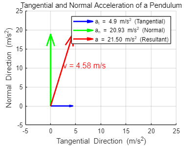

진자의 동적 애니메이션

```matlab
% 주어진 값
L = 1; % 진자의 길이 (m)
g = 9.81; % 중력 가속도 (m/s^2)
theta0 = 30; % 초기 각도 (deg)
t_max = 10; % 애니메이션 시간 (s)
dt = 0.1; % 시간 간격

% 시간 벡터 생성
time = 0:dt:t_max;

% 추의 운동 시뮬레이션
theta = theta0 * cos(sqrt(g / L) * time); % 단순 진자 운동의 각도 (rad)
at = g * sind(theta); % 접선 방향 가속도
an = g * cosd(theta); % 법선 방향 가속도
x = L * sind(theta); % 추의 x좌표
y = -L * cosd(theta); % 추의 y좌표

% 속도 및 가속도 계산
velocity = sqrt((L * sqrt(g / L) * sind(theta)).^2); % 속도 계산
acceleration = sqrt(at.^2 + an.^2); % 가속도 크기 계산

% 애니메이션 생성
figure;
hold on;
for i = 1:length(time)
    % 진자의 위치 업데이트
    clf;
    
    % 추의 위치 그리기
    plot([0 x(i)], [0 y(i)], 'b', 'LineWidth', 2); % 추의 줄 그리기
    hold on;
    plot(x(i), y(i), 'ro', 'MarkerSize', 10, 'MarkerFaceColor', 'r'); % 추 그리기
    
    % 속도 및 가속도 화살표 그리기
    quiver(x(i), y(i), velocity(i)*cosd(theta(i)), velocity(i)*sind(theta(i)), 'Color', 'g', 'MaxHeadSize', 0.5, 'LineWidth', 2, 'DisplayName', 'Velocity');
    quiver(x(i), y(i), acceleration(i)*cosd(theta(i)), acceleration(i)*sind(theta(i)), 'Color', 'r', 'MaxHeadSize', 0.5, 'LineWidth', 2, 'DisplayName', 'Acceleration');
    
    % 그래프 설정
    axis equal;
    xlim([-L L]);
    ylim([-L L]);
    title(sprintf('Time: %.1f s', time(i)));
    xlabel('X Position (m)');
    ylabel('Y Position (m)');
    legend('Pendulum', 'Velocity', 'Acceleration');
    grid on;
    
    % 애니메이션 속도 제어
    pause(dt);
end

hold off;
```

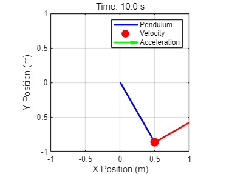

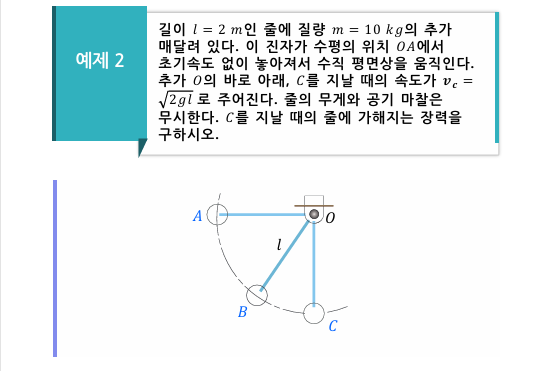


**문제 요약**

-  줄의 길이 $l=2\,m$ 
-  추의 질량 $m=10\,kg$ 
-  점 C를 지날 때의 속도 $v_c =\sqrt{2gl}$ � 
-  중력 가속도 $g=9.81\,m/s^2$ 
-  C를 지날 때의 줄에 가해지는 장력 $P$ 를 구하는 것이 목표입니다. 

**풀이 과정**


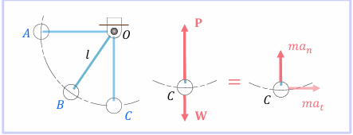


 **1. 속도** $v_c$ **계산** 


이미지에서 제시된 대로, 속도 $v_c =\sqrt{2gl}$ 이며,

 $$ v_c =\sqrt{2\cdot 9.81\cdot 2}=\sqrt{39.24}\approx 6.27\,m/s $$ 

 **2. 중력에 의한 힘** $W$ **계산**


추의 무게 $W$ 는

 $$ W=mg=10\times 9.81=98.1\,N $$ 

**3. 가속도 분석**


C점을 지날 때 접선 방향 가속도 $a_t$ 는 0이므로, 작용하는 힘은 법선 방향 가속도만 고려됩니다.

 $$ \sum F_n =ma_n =P-W $$ 

**4. 구심 가속도에 의한 힘 계산**


구심 가속도 $a_n =\frac{v_c^2 }{l}$ ��이므로,

 $$ a_n =\frac{(6.27)^2 }{2}=\frac{39.24}{2}=19.62\,m/s^2 $$ 

따라서,


 $ma_n =m\frac{v_c^2 }{l}$ ��


여기서 $m=10\,kg,v_c^2 =39.24,g=9.81,l=2,W=98.1\,N$ 이므로,

 $$ P-W=10\times 19.62 $$ 

 $$ P-98.1=196.2 $$ 

 $$ P=294.3\,N $$ 

**결론**


점 C를 지날 때 줄에 가해지는 장력은 $P=294.3\,N$ 입니다.

## 다른 계산과정
1.   **중력에 의한 힘** $W$ **계산** :

 $$ W=mg=10\times 9.81=98.1\,N $$ 

1.   **점 C에서의 총 장력** $P$ :

-  장력 $P$ 는 중력 $W$ 와 구심 가속도에 의한 추가 힘의 합으로 구성됩니다. 

 $P=W+\frac{Wv^2 }{gl}$ �


여기서 $v^2 =2gl$ 이므로,

 $$ P=W+\frac{W(2gl)}{gl} $$ 

 $$ P=W+2W=3W $$ 

따라서,

 $$ P=3\times 98.1=294.3\,N $$ 

**결론**

-  점 C를 지날 때 줄에 가해지는 장력은 $P=294.3\,N$ 입니다. 
```matlab
% 주어진 값
m = 10; % 질량 (kg)
g = 9.81; % 중력 가속도 (m/s^2)
l = 2; % 줄의 길이 (m)

% C점에서의 속도
v_c = sqrt(2 * g * l); % 점 C에서의 속도 (m/s)

% 힘 계산
W = m * g; % 중력에 의한 힘 (N)
P = 3 * W; % 줄에 가해지는 총 장력 (N)
an = v_c^2 / l; % 구심 가속도 계산

% 3차원 시각화를 위한 각도와 좌표 계산
theta = linspace(0, pi / 2, 100); % 0부터 90도까지 각도
x = l * sin(theta); % x좌표
y = zeros(size(theta)); % y좌표 (평면상 0)
z = -l * cos(theta); % z좌표 (높이)

% 3차원 그래프 생성
figure;
hold on;
grid on;

% 진자의 경로 그리기
plot3(x, y, z, 'b', 'LineWidth', 2, 'DisplayName', 'Pendulum Path');

% 점 C 위치
x_C = l * sin(pi / 2);
y_C = 0;
z_C = -l * cos(pi / 2);

% 점 C에서 추의 위치와 힘의 벡터 그리기
scatter3(x_C, y_C, z_C, 50, 'r', 'filled', 'DisplayName', 'Point C (Mass Position)');

% 중력에 의한 힘 그리기
quiver3(x_C, y_C, z_C, 0, 0, -W/5, 'Color', 'g', 'LineWidth', 2, 'DisplayName', 'Weight (W)', 'MaxHeadSize', 1.5);

% 장력 그리기
quiver3(x_C, y_C, z_C, 0, 0, -P/5, 'Color', 'm', 'LineStyle', '--', 'LineWidth', 2, 'DisplayName', 'Tension (P)', 'MaxHeadSize', 1.5);

% 구심 가속도에 의한 힘 그리기
quiver3(x_C, y_C, z_C, 0, 0, -(m * an)/5, 'Color', 'cyan', 'LineWidth', 2, 'DisplayName', 'Centripetal Force (ma_n)', 'MaxHeadSize', 1.5);

% 그래프 설정
title('3D Visualization of the Pendulum at Point C');
xlabel('X Position (m)');
ylabel('Y Position (m)');
zlabel('Z Position (m)');
legend('show'); % 범례 표시
axis equal;
axis([-2 2 -2 2 -3 1]); % 축 범위 설정을 더 넓게 조절

% 보기 각도 설정
view(130, 25); % 보기 각도 설정 (elevation, azimuth)

hold off;

xlim([-2.32 3.89])
ylim([-3.68 3.41])
zlim([-2.99 1.00])
legend(["Pendulum Path", "Point C (Mass Position)", "Weight (W)", "Tension (P)", "Centripetal Force (ma_n)"], "Position", [0.4966 0.6280 0.4802, 0.2710])
```

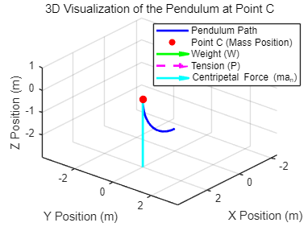

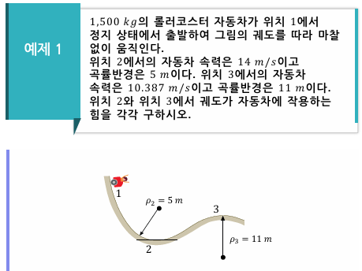


**문제 요약**

-  차량의 질량: $m=1500\,kg$ 
-  위치 2에서의 속도: $v_2 =14\,m/s$ 
-  위치 2에서의 곡률 반경: $\rho_2 =5\,m$ 
-  중력 가속도: $g=9.81\,m/s^2$ 
-  중력에 의한 힘 $W=mg=1500\cdot 9.81=14715\,N$ 

**풀이 과정****위치 2에서의 계산**

1.  **구심력 계산**:

-  구심 가속도 $a_n$ �: 

 $$ a_n =\frac{v_2^2 }{\rho_2 }=\frac{(14)^2 }{5}=\frac{196}{5}=39.2\,m/s^2 $$ 

-  구심력 $F_n =ma_n$ �: 

 $$ F_n =1500\cdot 39.2=58800\,N $$ 

1.  **차량에 작용하는 총 힘** $F_N$ **�**:

-  차량에 작용하는 총 힘은 중력과 구심력의 합입니다. 

 $$ F_N =W+F_n =14715+58800=73515\,N $$ 

따라서, 위치 2에서 차량에 작용하는 총력은 $F_N =73515\,N$ 또는 $73.515\,kN$ 입니다.

1.  **비율 계산**:

 $$ \frac{F_N }{W}=\frac{73515}{14715}\approx 5 $$ 

즉, $F_N =5W$ 


즉, 위치 2에서 줄에 가해지는 힘은 차량의 무게의 약 5배에 해당합니다.


**위치 3에서의 구심력 계산**

1.   **구심 가속도** $a_n$ **�**:

 $$ a_n =\frac{v_3^2 }{\rho_3 }=\frac{(10.387)^2 }{11}\approx \frac{107.89}{11}=9.81\,m/s^2 $$ 

1.   **구심력** $F_n$ **�**:

 $$ F_n =m\cdot a_n =1500\times 9.81\approx 14715\,N $$ 

1.   **총 수직 방향 힘** $F_N$ **�**:

-  위치 3에서의 총 수직 힘 $F_N$ �는 중력에서 구심력을 뺀 값입니다. 

 $$ W-F_N =m\cdot a_n $$ 

 $$ F_N =W-m\cdot a_n =14,715-14,712.23=2.73\,N $$ 

 $$ \frac{F_N }{W}=\frac{2.73N}{14,715N}=\,1.855\times 10⁻⁴N $$ 

따라서 위치 3에서 차량에 작용하는 총력은 $F_N =0$ 입니다.

```matlab
% 주어진 값
m = 1500; % 차량의 질량 (kg)
g = 9.81; % 중력 가속도 (m/s^2)
W = m * g; % 중력에 의한 힘 (N)

% 위치 2에서의 값
v2 = 14; % 위치 2에서의 속도 (m/s)
rho2 = 5; % 위치 2에서의 곡률 반경 (m)

% 위치 3에서의 값
v3 = 10.387; % 위치 3에서의 속도 (m/s)
rho3 = 11; % 위치 3에서의 곡률 반경 (m)

% 위치 2에서의 구심 가속도 및 힘 계산
an2 = v2^2 / rho2; % 위치 2에서의 구심 가속도 (m/s^2)
Fn2 = m * an2; % 위치 2에서의 구심력 (N)
F_N2 = W + Fn2; % 위치 2에서의 차량에 작용하는 총력 (N)

% 위치 3에서의 구심 가속도 및 힘 계산
an3 = v3^2 / rho3; % 위치 3에서의 구심 가속도 (m/s^2)
Fn3 = m * an3; % 위치 3에서의 구심력 (N)
F_N3 = W - Fn3; % 위치 3에서의 차량에 작용하는 총력 (N)

% 결과 출력
fprintf('위치 2에서 차량에 작용하는 총력: %.2f N\n', F_N2);
```

```matlabTextOutput
위치 2에서 차량에 작용하는 총력: 73515.00 N
```

```matlab
fprintf('위치 3에서 차량에 작용하는 총력: %.2f N\n', F_N3);
```

```matlabTextOutput
위치 3에서 차량에 작용하는 총력: 2.76 N
```

```matlab
% 롤러코스터 경로의 곡선 반경
rho1 = 5; % 위치 2까지의 곡률 반경 (m)
rho2 = 11; % 위치 3까지의 곡률 반경 (m)
g = 9.81; % 중력 가속도 (m/s^2)

% 곡선의 좌표 생성
theta1 = linspace(pi, 3*pi/2, 50); % 위치 1에서 2까지의 곡선 (90도 회전)
theta2 = linspace(0, pi, 100); % 위치 2에서 3까지의 곡선 (180도 회전)

% 위치 1에서 2까지의 좌표
x1 = rho1 * (cos(theta1) - 1); % X좌표 이동
y1 = rho1 * sin(theta1); % Y좌표

% 위치 2에서 3까지의 좌표 (2에서 이어지는)
x2 = rho1 + rho2 * (1 - cos(theta2)); % 이전 위치에서 이동하며 생성
y2 = rho2 * sin(theta2) - rho1; % Y축 아래로 이동

% 전체 경로의 X, Y 좌표 합치기
x = [x1, x2];
y = [y1, y2];

% 초기 속도 설정
v = 0; % 초기 속도 (m/s)
dt = 0.1; % 시간 간격 (s)

% 동적 그래프 생성
figure;
hold on;
plot(x, y, 'k-', 'LineWidth', 2); % 전체 경로 그리기
grid on;

% 위치 2와 3 표시
plot(x1(end), y1(end), 'ko', 'MarkerSize', 6, 'MarkerFaceColor', 'r'); % 위치 2
plot(x2(end), y2(end), 'ko', 'MarkerSize', 6, 'MarkerFaceColor', 'r'); % 위치 3

% 롤러코스터 표시용 핸들 생성
rollerCoaster = plot(x(1), y(1), 'ro', 'MarkerSize', 10, 'MarkerFaceColor', 'r');

% 속도, 가속도, 각도 표시용 텍스트 생성
speedText = text(-8, 8, sprintf('Speed: %.2f m/s', v), 'FontSize', 10);
accText = text(-8, 7, sprintf('Acceleration: %.2f m/s^2', 0), 'FontSize', 10);
angleText = text(-8, 6, sprintf('Angle: %.2f°', 0), 'FontSize', 10); % 각도 표시 추가

% 그래프 설정
xlabel('X Position (m)');
ylabel('Y Position (m)');
title('Dynamic Animation of the Roller Coaster with Speed, Acceleration, and Angle');
axis equal;
xlim([-10, 15]);
ylim([-15, 10]);

% 애니메이션 생성
for t = 2:length(x)
    % 속도 및 가속도 계산
    dx = x(t) - x(t-1);
    dy = y(t) - y(t-1);
    distance = sqrt(dx^2 + dy^2); % 두 지점 사이의 거리
    a = g * sin(atan2(dy, dx)); % 가속도 (중력에 의한 가속도)
    
    % 속도 업데이트
    v = v + a * dt; % v = u + at
    
    % 각도 계산 (라디안에서 도로 변환)
    angle = atan2(dy, dx) * (180 / pi); % 각도 계산 (rad를 deg로 변환)
    
    % 롤러코스터 위치 업데이트
    set(rollerCoaster, 'XData', x(t), 'YData', y(t));
    
    % 속도, 가속도, 각도 텍스트 업데이트
    set(speedText, 'String', sprintf('Speed: %.2f m/s', v));
    set(accText, 'String', sprintf('Acceleration: %.2f m/s^2', a));
    set(angleText, 'String', sprintf('Angle: %.2f°', angle)); % 각도 표시 업데이트
    
    pause(0.05); % 애니메이션 속도 조절
end

hold off;
```

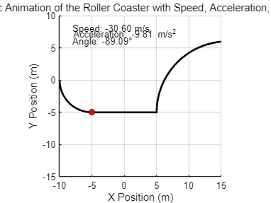

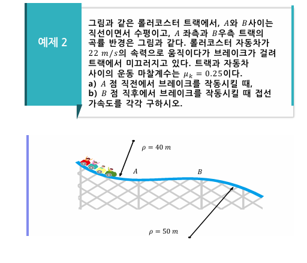


 **1.** **기본 정보와 공식을 정리**

-  주어진 값: 
-  마찰계수 $\mu_k =0.25$ 
-  중력 가속도 $g=9.81\,m/s^2$ 
-  롤러코스터의 속도 $v=22\,m/s$ 
-  곡률 반경: 
-  A점에서 $\rho_A =40\,m$ 
-  B점에서 $\rho_B =50\,m$ 

 **2.** **A점에서의 계산**


**2.1 법선 방향에서의 힘 균형**

-  법선 방향의 힘의 균형식을 세웁니다. 

 $$ \sum F_n =ma_n $$ 

 $AF_N -mg=m\frac{v^2 }{\rho_A }$ �


여기서 $F_N$ 은 법선력, $m$ 은 롤러코스터의 질량, $a_n$ 은 법선 가속도입니다.


**2.2 법선력** $F_N$ **계산** 

 $$ F_N =m\left(g+\frac{v^2 }{\rho_A }\right) $$ 

 **2.3 마찰력** $F$ **계산** 


마찰력은 다음과 같습니다.

 $$ F=\mu_k F_N =\mu_k m\left(g+\frac{v^2 }{\rho_A }\right) $$ 

 **2.4 접선 가속도** $a_t$ **계산** 


접선 방향의 힘 균형식을 세우면


 $-F=ma_t$ �


따라서,

 $$ a_t =-\frac{F}{m}=-\mu_k \left(g+\frac{v^2 }{\rho_A }\right) $$ 

계산에 대입하면

 $$ a_t =-0.25\left(9.81+\frac{22^2 }{40}\right) $$ 

 $$ a_t =-0.25\times (9.81+12.1)=-5.48\,m/s^2 $$ 

**3. B점에서의 계산**


**3.1 법선 방향에서의 힘 균형**

 $$ \sum F_n =ma_n $$ 

 $$ mg-F_N =m\frac{v^2 }{\rho_B } $$ 

� **3.2 법선력** $F_N$ **�** **계산** 

 $$ F_N =m\left(g-\frac{v^2 }{\rho_B }\right) $$ 

 **3.3 마찰력** $F$ **계산** 

 $$ F=\mu_k F_N =\mu_k m\left(g-\frac{v^2 }{\rho_B }\right) $$ 

 **3.4 접선 가속도** $a_t$ **�** **계산** 

 $$ a_t =-\frac{F}{m}=-\mu_k \left(g-\frac{v^2 }{\rho_B }\right) $$ 

계산에 대입하면

 $$ a_t =-0.25\left(9.81-\frac{22^2 }{50}\right) $$ 

 $$ a_t =-0.25\times (9.81-9.68)=-0.033\,m/s^2 $$ 

**최종 결과**

-  A점에서의 접선 가속도: $a_t =-5.48\,m/s^2$ 
-  B점에서의 접선 가속도: $a_t =-0.033\,m/s^2$ 
```matlab
% 주어진 값
mu_k = 0.25; % 마찰계수
g = 9.81; % 중력 가속도 (m/s^2)
v = 22; % 속도 (m/s)
rho_A = 40; % A점에서의 곡률 반경 (m)
rho_B = 50; % B점에서의 곡률 반경 (m)

% A점에서의 접선 가속도 계산
a_t_A = -mu_k * (g + (v^2 / rho_A)); % A점 접선 가속도 (m/s^2)

% B점에서의 접선 가속도 계산
a_t_B = -mu_k * (g - (v^2 / rho_B)); % B점 접선 가속도 (m/s^2)

% 결과 출력
fprintf('A 점에서 브레이크를 작동시킬 때 접선 가속도: %.3f m/s^2\n', abs(a_t_A));
```

```matlabTextOutput
A 점에서 브레이크를 작동시킬 때 접선 가속도: 5.478 m/s^2
```

```matlab
fprintf('B 점에서 브레이크를 작동시킬 때 접선 가속도: %.3f m/s^2\n', abs(a_t_B));
```

```matlabTextOutput
B 점에서 브레이크를 작동시킬 때 접선 가속도: 0.033 m/s^2
```

브레이크없이 작동

```matlab
% 주어진 값
g = 9.81; % 중력 가속도 (m/s^2)
v_initial = 0; % 초기 속도 (m/s), 정지 상태에서 시작
rho_A = 40; % A점에서의 곡률 반경 (m)
rho_B = 50; % B점에서의 곡률 반경 (m)
dt = 0.1; % 시간 간격 (초)
time_total = 10; % 총 시뮬레이션 시간 (초)
h_initial = 20; % A점의 초기 높이 (m)

% 경로 설정 (A와 B 사이 평평하게 표현)
x_A = linspace(0, rho_A, 100); % A점부터의 x 좌표
y_A = h_initial - 0.5 * (1 - cos(pi * x_A / rho_A)) * 10; % 부드러운 곡선 모양을 위한 y 좌표 (높이에서 시작)

x_flat = linspace(x_A(end), x_A(end) + 10, 50); % 평평한 구간의 x 좌표
y_flat = ones(size(x_flat)) * y_A(end); % 평평한 구간의 y 좌표

x_B = linspace(x_flat(end), x_flat(end) + rho_B, 100); % B점까지의 x 좌표
y_B = y_flat(end) - 0.5 * (1 - cos(pi * (x_B - x_flat(end)) / rho_B)) * 8; % 곡선의 하강 부분

% 전체 경로 설정
x_total = [x_A, x_flat, x_B];
y_total = [y_A, y_flat, y_B];

% 초기 속도 및 가속도
velocity = sqrt(2 * g * (h_initial - y_total(1))); % 초기 위치에서의 속도 계산 (에너지 보존에 의한 계산)
a_t = 0; % 브레이크를 작동하지 않으므로 가속도는 중력 가속도에 의해 결정

% 동적 그래프 생성
figure;
hold on;
plot(x_total, y_total, 'b-', 'LineWidth', 3); % 경로 그리기
rollerCoaster = plot(x_total(1), y_total(1), 'ro', 'MarkerSize', 10, 'MarkerFaceColor', 'r'); % 롤러코스터 위치 표시
speedText = text(10, 25, sprintf('Speed: %.2f m/s', velocity), 'FontSize', 10); % 속도 표시
accText = text(10, 23, sprintf('Acceleration: %.2f m/s^2', a_t), 'FontSize', 10); % 가속도 표시
angleText = text(10, 21, sprintf('Angle: %.2f°', 0), 'FontSize', 10); % 각도 표시

% 그래프 설정
xlabel('X Position (m)');
ylabel('Y Position (m)');
title('Dynamic Graph of Roller Coaster Motion Starting from a High Position');
axis equal;
xlim([-10, rho_A + rho_B + 20]);
ylim([0, h_initial + 5]);
grid on;

% 애니메이션 업데이트
for i = 1:length(x_total)
    % 현재 위치 업데이트
    set(rollerCoaster, 'XData', x_total(i), 'YData', y_total(i));
    
    % 속도 업데이트 (에너지 보존에 의한 계산)
    if i > 1
        h = y_total(1) - y_total(i); % 초기 높이와 현재 높이의 차이
        velocity = sqrt(2 * g * h); % 위치에 따른 속도 계산
    end
    
    % 각도 계산 (접선의 기울기)
    if i > 1
        dx = x_total(i) - x_total(i - 1);
        dy = y_total(i) - y_total(i - 1);
        angle = atan2(dy, dx) * (180 / pi); % 각도 계산 (라디안을 도로 변환)
    else
        angle = 0;
    end
    
    % 가속도 업데이트 (중력 가속도에 의한 영향)
    a_t = g * sin(angle * pi / 180); % 각도에 따른 가속도
    
    % 속도, 가속도, 각도 텍스트 업데이트
    set(speedText, 'String', sprintf('Speed: %.2f m/s', velocity));
    set(accText, 'String', sprintf('Acceleration: %.2f m/s^2', a_t));
    set(angleText, 'String', sprintf('Angle: %.2f°', angle));
    
    % 애니메이션 속도 조절
    pause(0.1);
end

hold off;
```

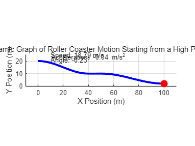


A 지점에서의 브레이크 작동

```matlab
% 주어진 값
mu_k = 0.25; % 마찰계수
g = 9.81; % 중력 가속도 (m/s^2)
v_initial = 0; % 초기 속도 (m/s), 정지 상태에서 시작
rho_A = 40; % A점에서의 곡률 반경 (m)
rho_B = 50; % B점에서의 곡률 반경 (m)
dt = 0.1; % 시간 간격 (초)
time_total = 10; % 총 시뮬레이션 시간 (초)
h_initial = 20; % A점의 초기 높이 (m)

% 경로 설정 (A와 B 사이 평평하게 표현)
x_A = linspace(0, rho_A, 100); % A점부터의 x 좌표
y_A = h_initial - 0.5 * (1 - cos(pi * x_A / rho_A)) * 10; % 부드러운 곡선 모양을 위한 y 좌표 (높이에서 시작)

x_flat = linspace(x_A(end), x_A(end) + 10, 50); % 평평한 구간의 x 좌표
y_flat = ones(size(x_flat)) * y_A(end); % 평평한 구간의 y 좌표

x_B = linspace(x_flat(end), x_flat(end) + rho_B, 100); % B점까지의 x 좌표
y_B = y_flat(end) - 0.5 * (1 - cos(pi * (x_B - x_flat(end)) / rho_B)) * 8; % 곡선의 하강 부분

% 전체 경로 설정
x_total = [x_A, x_flat, x_B];
y_total = [y_A, y_flat, y_B];

% 초기 속도 및 가속도
velocity = sqrt(2 * g * (h_initial - y_total(1))); % 초기 위치에서의 속도 계산 (에너지 보존에 의한 계산)
a_t = 0; % 초기에는 가속도는 0 (브레이크 작동 전)

% 동적 그래프 생성
figure;
hold on;
plot(x_total, y_total, 'b-', 'LineWidth', 3); % 경로 그리기
rollerCoaster = plot(x_total(1), y_total(1), 'ro', 'MarkerSize', 10, 'MarkerFaceColor', 'r'); % 롤러코스터 위치 표시
speedText = text(10, 25, sprintf('Speed: %.2f m/s', velocity), 'FontSize', 10); % 속도 표시
accText = text(10, 23, sprintf('Acceleration: %.2f m/s^2', a_t), 'FontSize', 10); % 가속도 표시
angleText = text(10, 21, sprintf('Angle: %.2f°', 0), 'FontSize', 10); % 각도 표시

% 그래프 설정
xlabel('X Position (m)');
ylabel('Y Position (m)');
title('Dynamic Graph of Roller Coaster Motion with Braking Applied at Point A');
axis equal;
xlim([-10, rho_A + rho_B + 20]);
ylim([0, h_initial + 5]);
grid on;

% 애니메이션 업데이트
for i = 1:length(x_total)
    % 현재 위치 업데이트
    set(rollerCoaster, 'XData', x_total(i), 'YData', y_total(i));
    
    % 속도 업데이트 (에너지 보존 및 마찰력에 의한 감속 고려)
    if i > 1
        h = y_total(1) - y_total(i); % 초기 높이와 현재 높이의 차이
        % 브레이크 작동으로 인한 속도 변화 (마찰력에 의한 감속)
        velocity = sqrt(max(0, 2 * g * h - 2 * mu_k * g * (x_total(i) - x_total(1)))); % 속도 업데이트
        
        if velocity < 0
            velocity = 0; % 속도가 음수가 되지 않도록 처리
        end
    end
    
    % 각도 계산 (접선의 기울기)
    if i > 1
        dx = x_total(i) - x_total(i - 1);
        dy = y_total(i) - y_total(i - 1);
        angle = atan2(dy, dx) * (180 / pi); % 각도 계산 (라디안을 도로 변환)
    else
        angle = 0;
    end
    
    % 가속도 업데이트 (브레이크 작동 시의 감속도 반영)
    a_t = -mu_k * g * cos(angle * pi / 180); % 각도에 따른 가속도 (브레이크에 의한 감속 반영)
    
    % 속도, 가속도, 각도 텍스트 업데이트
    set(speedText, 'String', sprintf('Speed: %.2f m/s', velocity));
    set(accText, 'String', sprintf('Acceleration: %.2f m/s^2', a_t));
    set(angleText, 'String', sprintf('Angle: %.2f°', angle));
    
    % 애니메이션 속도 조절
    pause(0.1);
end

hold off;
```

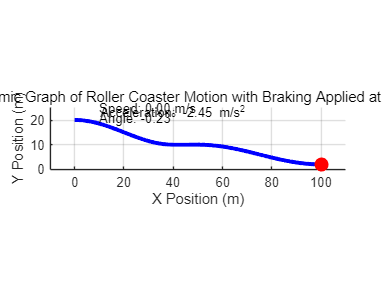


B 지점에서의 브레이크 작동

```matlab
% 주어진 값
mu_k = 0.25; % 마찰계수
g = 9.81; % 중력 가속도 (m/s^2)
v_initial = 0; % 초기 속도 (m/s), 정지 상태에서 시작
rho_A = 40; % A점에서의 곡률 반경 (m)
rho_B = 50; % B점에서의 곡률 반경 (m)
dt = 0.1; % 시간 간격 (초)
time_total = 10; % 총 시뮬레이션 시간 (초)
h_initial = 20; % A점의 초기 높이 (m)

% 경로 설정 (A와 B 사이 평평하게 표현)
x_A = linspace(0, rho_A, 100); % A점부터의 x 좌표
y_A = h_initial - 0.5 * (1 - cos(pi * x_A / rho_A)) * 10; % 부드러운 곡선 모양을 위한 y 좌표 (높이에서 시작)

x_flat = linspace(x_A(end), x_A(end) + 10, 50); % 평평한 구간의 x 좌표
y_flat = ones(size(x_flat)) * y_A(end); % 평평한 구간의 y 좌표

x_B = linspace(x_flat(end), x_flat(end) + rho_B, 100); % B점까지의 x 좌표
y_B = y_flat(end) - 0.5 * (1 - cos(pi * (x_B - x_flat(end)) / rho_B)) * 8; % 곡선의 하강 부분

% 전체 경로 설정
x_total = [x_A, x_flat, x_B];
y_total = [y_A, y_flat, y_B];

% 초기 속도 및 가속도
velocity = sqrt(2 * g * (h_initial - y_total(1))); % 초기 위치에서의 속도 계산 (에너지 보존에 의한 계산)
a_t = 0; % 초기에는 가속도는 0 (브레이크 작동 전)

% 동적 그래프 생성
figure;
hold on;
plot(x_total, y_total, 'b-', 'LineWidth', 3); % 경로 그리기
rollerCoaster = plot(x_total(1), y_total(1), 'ro', 'MarkerSize', 10, 'MarkerFaceColor', 'r'); % 롤러코스터 위치 표시
speedText = text(10, 25, sprintf('Speed: %.2f m/s', velocity), 'FontSize', 10); % 속도 표시
accText = text(10, 23, sprintf('Acceleration: %.2f m/s^2', a_t), 'FontSize', 10); % 가속도 표시
angleText = text(10, 21, sprintf('Angle: %.2f°', 0), 'FontSize', 10); % 각도 표시

% 그래프 설정
xlabel('X Position (m)');
ylabel('Y Position (m)');
title('Dynamic Graph of Roller Coaster Motion with Braking Applied at Point B');
axis equal;
xlim([-10, rho_A + rho_B + 20]);
ylim([0, h_initial + 5]);
grid on;

% 애니메이션 업데이트
brake_started = false; % 브레이크 작동 여부 확인

for i = 1:length(x_total)
    % 현재 위치 업데이트
    set(rollerCoaster, 'XData', x_total(i), 'YData', y_total(i));
    
    % 속도 업데이트 (에너지 보존 및 마찰력에 의한 감속 고려)
    if i > 1
        h = y_total(1) - y_total(i); % 초기 높이와 현재 높이의 차이
        
        % B지점 이후에 브레이크 작동
        if x_total(i) > x_flat(end) && ~brake_started
            brake_started = true;
            fprintf('Braking started at Point B\n');
        end
        
        if brake_started
            % 브레이크 작동 시 마찰력에 의한 감속 효과
            velocity = max(0, velocity - mu_k * g * dt); % 속도 감소
        else
            % 브레이크 작동 전은 에너지 보존에 의한 속도 계산
            velocity = sqrt(max(0, 2 * g * h));
        end
    end
    
    % 각도 계산 (접선의 기울기)
    if i > 1
        dx = x_total(i) - x_total(i - 1);
        dy = y_total(i) - y_total(i - 1);
        angle = atan2(dy, dx) * (180 / pi); % 각도 계산 (라디안을 도로 변환)
    else
        angle = 0;
    end
    
    % 가속도 업데이트
    if brake_started
        a_t = -mu_k * g * cos(angle * pi / 180); % 브레이크 작동 시의 감속도
    else
        a_t = g * sin(angle * pi / 180); % 브레이크 작동 전은 중력 가속도에 의한 가속도
    end
    
    % 속도, 가속도, 각도 텍스트 업데이트
    set(speedText, 'String', sprintf('Speed: %.2f m/s', velocity));
    set(accText, 'String', sprintf('Acceleration: %.2f m/s^2', a_t));
    set(angleText, 'String', sprintf('Angle: %.2f°', angle));
    
    % 애니메이션 속도 조절
    pause(0.1);
end
```

```matlabTextOutput
Braking started at Point B
```

```matlab

hold off;
```


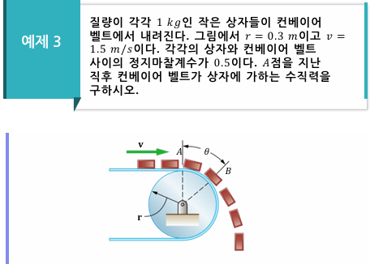

-  질량 $m=1\,kg$ 인 작은 상자가 컨베이어 벨트에서 내려집니다. 
-  반지름 $r=0.3\,m$ 이고, 벨트의 속도 $v=1.5\,m/s$ 입니다. 
-  각 지점에서의 접지마찰계수 $\mu_k =0.5$ 입니다. 

목표는 A점을 지난 이후 벨트가 상자에 가하는 수직력을 계산하는 것입니다.


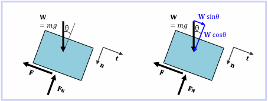


**수직력 계산**

 $$ ∑Fn=ma_n $$ 

 $mg\cos \theta -F_N =m\frac{v^2 }{\rho }$ �


여기서 $\theta =0$ 인 경우


 $F_N =mg-m\frac{v^2 }{\rho }$ �


**주어진 값을 대입하여 계산**

-  $\displaystyle m=1\,kg$ 
-  $\displaystyle g=9.81\,m/s^2$ 
-  $\displaystyle v=1.5\,m/s$ 
-  $\displaystyle \rho =0.3\,m$ 

 $$ F_N =(1\,kg)(9.81\,m/s^2 )-(1\,kg)\frac{(1.5\,m/s)^2 }{0.3\,m} $$ 

 $$ F_N =9.81-7.5 $$ 

 $$ F_N =2.31\,N $$ 

따라서 최종적으로 $F_N =2.31\,N$ 로 계산됩니다.


A점을 지난 후 벨트가 상자에 가하는 수직력 $F_n$ 은 약 $2.31N$ 입니다. 또한 이 수직력에 의한 마찰력 $F_f$ 은 약 $1.155N$ 입니다.

```matlab
% 주어진 값
m = 1.0; % 질량 (kg)
g = 9.81; % 중력 가속도 (m/s^2)
r = 0.3; % 반지름 (m)
v = 1.5; % 속도 (m/s)
mu_k = 0.5; % 마찰계수

% 원심력 계산
F_c = (m * v^2) / r;

% 중력에 의한 힘
F_g = m * g;

% 벨트가 상자에 가하는 수직력 계산
F_N = F_g - F_c;

% 마찰력 계산
F_f = mu_k * F_N;

% 결과 출력
fprintf('A점을 지난 직후 컨베이어 벨트가 상자에 가하는 수직력은 %.2f N입니다.\n', F_N);
```

```matlabTextOutput
A점을 지난 직후 컨베이어 벨트가 상자에 가하는 수직력은 2.31 N입니다.
```

```matlab
fprintf('마찰력은 %.2f N입니다.\n', F_f);
```

```matlabTextOutput
마찰력은 1.16 N입니다.
```

```matlab

% 3차원 그래프 생성
figure;
hold on;
grid on;

% 상자의 위치를 원형 경로로 나타냄
theta = linspace(0, pi/2, 100); % 90도 각도까지의 움직임
x = r * cos(theta);
y = r * sin(theta);
z = zeros(size(theta));

% 상자의 이동 경로 그리기
plot3(x, y, z, 'b', 'LineWidth', 2);

% 수직력 벡터 추가
quiver3(0, 0, 0, 0, 0, F_N, 'r', 'LineWidth', 2, 'MaxHeadSize', 0.5);

% 마찰력 벡터 추가 (x축을 따라 작용하는 것으로 가정)
quiver3(0, 0, 0, F_f, 0, 0, 'g', 'LineWidth', 2, 'MaxHeadSize', 0.5);

% 원심력 벡터 추가 (y축을 따라 작용하는 것으로 가정)
quiver3(0, 0, 0, 0, F_c, 0, 'm', 'LineWidth', 2, 'MaxHeadSize', 0.5);

% 축 설정 및 그래프 라벨링
xlabel('X 방향 (마찰력)');
ylabel('Y 방향 (원심력)');
zlabel('Z 방향 (수직력)');
title('컨베이어 벨트 위 상자에 작용하는 힘의 3D 시각화');

% 범례 추가
legend('상자의 경로', '수직력 (F_n)', '마찰력 (F_f)', '원심력 (F_c)');

% 그래프 표시
hold off;
```

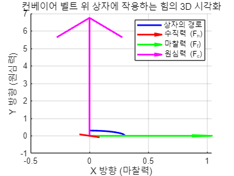

-  **파란색 선**: 상자의 경로 
-  **빨간색 화살표**: 수직력 $F_n$ � 
-  **녹색 화살표**: 마찰력 $F_f$ � 
-  **보라색 화살표**: 원심력 $F_c$ 
```matlab
% 주어진 값
m = 1.0; % 질량 (kg)
g = 9.81; % 중력 가속도 (m/s^2)
r = 0.3; % 반지름 (m)
v = 1.5; % 속도 (m/s)
mu_k = 0.5; % 마찰계수

% 세타 값 설정 (0도부터 90도까지)
theta_values = linspace(0, pi/2, 100); % 0부터 90도까지의 각도
cos_theta = cos(theta_values);

% 수직력(Fn) 계산
Fn_values = m * g * cos_theta - (m * v^2) / r;

% 접지마찰 벗어나는 지점 찾기
break_point_index = find(Fn_values < 0, 1); % Fn이 처음으로 0보다 작아지는 지점 찾기
break_theta = theta_values(break_point_index); % 벗어나는 지점의 세타 값
break_fn_value = Fn_values(break_point_index); % 벗어나는 지점의 수직력 값

% 그래프 생성
figure;
hold on;
plot(theta_values * (180 / pi), Fn_values, 'b', 'LineWidth', 2); % 각도(°)로 변환하여 플로팅
yline(0, 'k--', '마찰력 한계 (벗어나는 지점)'); % 마찰력 한계 표시 (점선)
scatter(break_theta * (180 / pi), break_fn_value, 50, 'r', 'filled', 'DisplayName', '마찰 벗어나는 지점'); % 벗어나는 지점 표시

% 그래프 설정
title('세타에 따른 수직력과 마찰이 벗어나는 지점');
xlabel('세타 (각도, °)');
ylabel('수직력 (N)');
legend('수직력 (Fn)', '마찰력 한계 (벗어나는 지점)', '마찰 벗어나는 지점');
grid on;
hold off;
```

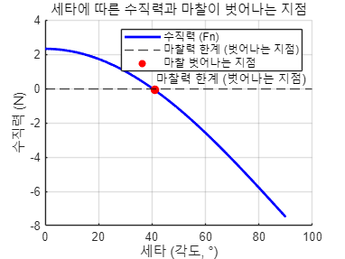

**A점과 B점 사이에서 브레이크를 작동시키는 경우**

-  마찰계수: $\mu_k =0.25$ 
-  속도: $v=22\,\textrm{m/s}$ 
-  곡률 반경: $\rho =\infty$ (평지에서의 무한한 곡률 반경) 

수직 방향의 힘 분석:

 $$ \sum F_n =ma_n \Rightarrow mg-F_N =m\frac{v^2 }{\rho }=0 $$ 

 $$ F_N =mg $$ 

마찰력:

 $$ F=\mu_k F_N =\mu_k mg $$ 

가속도 계산:

 $$ \sum F_t =ma_t \Rightarrow -F=ma_t $$ 

 $$ a_t =-\frac{F}{m}=-\mu_k g $$ 

 $$ a_t =-0.25\times 9.81=-2.45\,{\textrm{m/s}}^2 $$ 

따라서, 브레이크를 작동시키면 수평 방향에서 가속도는 $-2.45\,{\textrm{m/s}}^2$ 입니다.

```matlab
% 초기 설정
clear;
clc;
close all;

% 주어진 값
mu_k = 0.25; % 마찰계수
g = 9.81; % 중력 가속도 (m/s^2)
v_initial = 22; % A 지점에서의 초기 속도 (m/s)
h_initial = 20; % A 지점의 높이 (m)
dt = 0.1; % 시간 간격 (초)
t_total = 10; % 총 시뮬레이션 시간 (초)

% 경로 설정
rho_A = 40; % A점에서의 곡률 반지름 (m)
rho_B = 50; % B점에서의 곡률 반지름 (m)

% A 지점부터 평평한 구간을 나타내는 x, y 좌표 생성
x_A = linspace(0, rho_A, 100); % A 지점부터의 x 좌표
y_A = h_initial - 0.5 * (1 - cos(pi * x_A / rho_A)) * 10; % 부드러운 곡선 모양을 위한 y 좌표 (높이에서 시작)

x_flat = linspace(x_A(end), x_A(end) + 10, 50); % 평평한 구간의 x 좌표
y_flat = ones(size(x_flat)) * y_A(end); % 평평한 구간의 y 좌표

x_B = linspace(x_flat(end), x_flat(end) + rho_B, 100); % B 지점까지의 x 좌표
y_B = y_flat(end) - 0.5 * (1 - cos(pi * (x_B - x_flat(end)) / rho_B)) * 8; % 곡선의 하강 부분

% 전체 경로 설정
x_total = [x_A, x_flat, x_B];
y_total = [y_A, y_flat, y_B];

% 초기 속도, 가속도, 각도 및 위치
velocity = v_initial;
a_t = 0; % 초기 가속도는 0
angle = 0; % 초기 각도는 0

% 동적 그래프 설정
figure;
hold on;
plot(x_total, y_total, 'b-', 'LineWidth', 2); % 경로 그리기
rollerCoaster = plot(x_total(1), y_total(1), 'ro', 'MarkerSize', 10, 'MarkerFaceColor', 'r'); % 롤러코스터 위치 표시
speedText = text(10, 25, sprintf('Speed: %.2f m/s', velocity), 'FontSize', 10); % 속도 표시
accText = text(10, 23, sprintf('Acceleration: %.2f m/s^2', a_t), 'FontSize', 10); % 가속도 표시
angleText = text(10, 21, sprintf('Angle: %.2f°', angle), 'FontSize', 10); % 각도 표시

% 그래프 설정
xlabel('X Position (m)');
ylabel('Y Position (m)');
title('Roller Coaster Motion with Braking Applied at Flat Region');
axis equal;
xlim([-10, rho_A + rho_B + 20]);
ylim([0, h_initial + 5]);
grid on;

% 애니메이션 시작
brake_started = false; % 브레이크 작동 여부 확인

for i = 1:length(x_total)
    % 현재 위치 업데이트
    set(rollerCoaster, 'XData', x_total(i), 'YData', y_total(i));
    
    % 속도 업데이트 (에너지 보존 및 마찰력에 의한 감속 고려)
    if i > 1
        h = y_total(1) - y_total(i); % 초기 높이와 현재 높이의 차이
        
        % A 지점 이후 평지에서 브레이크 작동
        if x_total(i) >= x_flat(1) && ~brake_started
            brake_started = true;
            fprintf('Braking started at Flat Region\n');
        end
        
        if brake_started
            % 브레이크 작동 시 마찰력에 의한 감속 효과
            velocity = max(0, velocity - mu_k * g * dt); % 속도 감소
        else
            % 브레이크 작동 전은 에너지 보존에 의한 속도 계산
            velocity = sqrt(max(0, 2 * g * h));
        end
    end
    
    % 각도 계산 (접선의 기울기)
    if i > 1
        dx = x_total(i) - x_total(i - 1);
        dy = y_total(i) - y_total(i - 1);
        angle = atan2(dy, dx) * (180 / pi); % 각도 계산 (라디안을 도로 변환)
    else
        angle = 0;
    end
    
    % 가속도 업데이트
    if brake_started
        a_t = -mu_k * g; % 브레이크 작동 시의 감속도
    else
        a_t = g * sin(angle * pi / 180); % 브레이크 작동 전은 중력 가속도에 의한 가속도
    end
    
    % 속도, 가속도, 각도 텍스트 업데이트
    set(speedText, 'String', sprintf('Speed: %.2f m/s', velocity));
    set(accText, 'String', sprintf('Acceleration: %.2f m/s^2', a_t));
    set(angleText, 'String', sprintf('Angle: %.2f°', angle));
    
    % 애니메이션 속도 조절
    pause(0.1);
end
```

```matlabTextOutput
Braking started at Flat Region
```

```matlab

hold off;
```

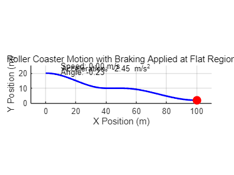


